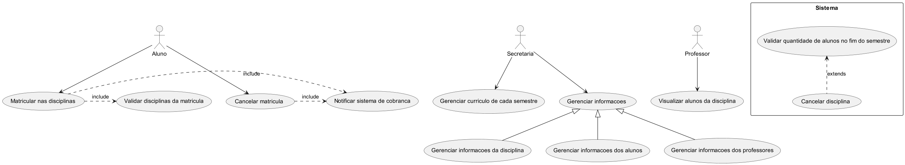

# Laboratório de Desenvolvimento de Software

# Sistema de Matrículas: 

---

## Histórias de Usuário: 

---

### *1. Gestão de Currículo*

**Como** secretária da universidade,  
**Eu quero** gerar o currículo para cada semestre,  
**Para que** as disciplinas, professores e alunos estejam organizados e prontos para o período de matrículas.

#### Critérios de Aceitação

1. **Dado que** o semestre está prestes a começar, **quando** a secretária acessar a funcionalidade de geração de currículo, **então** o sistema deve permitir a criação de um novo currículo para o semestre em questão.

2. **Dado que** a secretária está gerando o currículo para um novo semestre, **quando** ela inserir as disciplinas e seus respectivos detalhes (como código da disciplina, carga horária, etc.), **então** essas disciplinas devem ser registradas no currículo para o semestre atual.

3. **Dado que** a secretária está associando professores às turmas, **quando** ela selecionar um professor para uma turma, **então** o sistema deve registrar essa associação no currículo, incluindo informações sobre a carga horária e a alocação de cada professor.

___

### *2. Cadastro de Cursos e Disciplinas*

**Como** secretária da universidade,  
**Eu quero** cadastrar os cursos com seus respectivos nomes, créditos e disciplinas,  
**Para que** os alunos possam se matricular adequadamente conforme o currículo.

#### Critérios de Aceitação

1. **Dado que** a secretária está na interface de cadastro de cursos e disciplinas, **quando** ela iniciar o processo de cadastro de um novo curso, **então** o sistema deve permitir a inserção do nome do curso, número de créditos e outras informações relevantes.

2. **Dado que** a secretária está cadastrando um curso, **quando** ela preencher os detalhes do curso, **então** o sistema deve permitir que ela adicione e associe disciplinas ao curso, incluindo o nome, código e carga horária de cada disciplina.

3. **Dado que** a secretária está associando disciplinas a um curso, **quando** ela selecionar uma disciplina existente ou criar uma nova, **então** o sistema deve registrar a associação da disciplina com o curso e atualizar o currículo.

4. **Dado que** o curso e suas disciplinas foram cadastrados, **quando** a secretária salvar as informações, **então** o sistema deve registrar o curso e suas disciplinas na base de dados e garantir que estejam disponíveis para futuras consultas e matrículas.
5. **Dado que** um curso foi cadastrado com suas disciplinas, **quando** a secretária visualizar a lista de cursos, **então** o sistema deve exibir todos os cursos cadastrados com seus respectivos nomes, créditos e as disciplinas associadas a cada um.

6. **Dado que** a secretária está editando um curso ou suas disciplinas, **quando** ela fizer alterações e salvar as mudanças, **então** o sistema deve atualizar o curso e as disciplinas associadas na base de dados e refletir as alterações imediatamente.

7. **Dado que** a secretária está excluindo um curso ou uma disciplina, **quando** ela confirmar a exclusão, **então** o sistema deve remover o curso ou a disciplina da base de dados e garantir que não apareça mais nas listas e relatórios.

___

### *3. Período de Matrículas*

**Como** aluno,  
**Eu quero** acessar o sistema durante o período de matrículas,  
**Para que** eu possa me matricular em até 4 disciplinas obrigatórias e 2 optativas.

#### Critérios de Aceitação

1. **Dado que** o período de matrículas está aberto, **quando** o aluno acessar a página de matrículas, **então** ele deve ver a lista de disciplinas obrigatórias e optativas disponíveis para o semestre.

2. **Dado que** o aluno está na página de matrículas, **quando** ele selecionar até 4 disciplinas obrigatórias e até 2 optativas, **então** o sistema deve permitir que ele complete a matrícula nessas disciplinas e exibir uma confirmação de que as disciplinas foram registradas com sucesso.

3. **Dado que** o aluno já se matriculou em 4 disciplinas obrigatórias, **quando** ele tentar se matricular em uma disciplina obrigatória adicional, **então** o sistema deve exibir uma mensagem informando que o limite de disciplinas obrigatórias foi atingido.

4. **Dado que** o aluno já se matriculou em 2 disciplinas optativas, **quando** ele tentar se matricular em uma disciplina optativa adicional, **então** o sistema deve exibir uma mensagem informando que o limite de disciplinas optativas foi atingido.

5. **Dado que** o período de matrículas está fechado, **quando** o aluno tentar acessar a página de matrículas, **então** o sistema deve exibir uma mensagem informando que o período de matrículas encerrou e não permitirá a matrícula em novas disciplinas.
___
### *4. Cancelamento de Matrículas*

**Como** aluno,  
**Eu quero** poder cancelar minhas matrículas durante o período permitido,  
**Para que** eu possa ajustar minha carga horária de acordo com minhas necessidades.

#### Critérios de Aceitação

1. **Dado que** o período de cancelamento de matrículas está aberto, **quando** o aluno acessar a página de matrículas, **então** ele deve ver a opção de cancelar suas matrículas.

2. **Dado que** o aluno deseja cancelar uma matrícula, **quando** ele selecionar a disciplina para cancelamento e confirmar a ação, **então** a matrícula deve ser removida e o aluno deve receber uma confirmação de cancelamento.

3. **Dado que** o período de cancelamento de matrículas está fechado, **quando** o aluno tentar cancelar uma matrícula, **então** ele deve receber uma mensagem informando que o cancelamento não é mais permitido.

4. **Dado que** o aluno cancela uma matrícula, **quando** o sistema processar o cancelamento, **então** a vaga na disciplina deve ser liberada e disponível para outros alunos.

___
### *5. Ativação de Disciplinas*

**Como** sistema,  
**Eu quero** verificar se uma disciplina tem pelo menos 3 alunos matriculados no final do período de matrículas,  
**Para que** apenas disciplinas com alunos suficientes sejam oferecidas no semestre

#### Critérios de Aceitação

1. **Dado que** o período de matrículas terminou, **quando** o sistema verificar a quantidade de alunos matriculados em cada disciplina, **então** ele deve identificar quais disciplinas têm pelo menos 3 alunos matriculados.

2. **Dado que** uma disciplina tem 3 ou mais alunos matriculados, **quando** o sistema finalizar a verificação, **então** a disciplina deve ser marcada como ativa e disponível para o semestre.

3. **Dado que** uma disciplina tem menos de 3 alunos matriculados, **quando** o sistema finalizar a verificação, **então** a disciplina deve ser marcada como inativa e não disponível para o semestre.

___

### *6. Limite de Vagas em Disciplinas*

**Como** sistema,  
**Eu quero** encerrar as inscrições para uma disciplina quando atingir 60 alunos matriculados,  
**Para que** não ultrapasse o número máximo de alunos permitido por disciplina.

#### Critérios de Aceitação

1. **Dado que** o limite de vagas para uma disciplina é 60 alunos, **quando** o número de alunos matriculados na disciplina atingir 60, **então** o sistema deve automaticamente encerrar as inscrições para essa disciplina.

2. **Dado que** as inscrições para uma disciplina foram encerradas, **quando** um aluno tentar se matricular na disciplina, **então** ele deve receber uma mensagem informando que a disciplina atingiu o limite máximo de vagas.

3. **Dado que** um aluno tenta se matricular em uma disciplina que já atingiu o limite de vagas, **quando** o sistema processar a tentativa de matrícula, **então** o sistema deve não permitir a matrícula e informar o aluno que a disciplina está cheia.

4. **Dado que** o limite de 60 alunos foi atingido e as inscrições foram encerradas, **quando** um administrador acessar o sistema, **então** ele deve ver que as inscrições estão encerradas para essa disciplina e a informação deve estar visível na interface administrativa.

5. **Dado que** um aluno cancela sua matrícula em uma disciplina que está no limite de 60 alunos, **quando** a matrícula for cancelada, **então** o sistema deve liberar uma vaga e permitir que um novo aluno se matricule.

6. **Dado que** o sistema encerra inscrições quando a disciplina atinge o limite, **quando** o número de alunos matriculados for reduzido devido ao cancelamento de matrícula, **então** o sistema deve atualizar a disponibilidade de inscrições e permitir novas matrículas até o limite máximo.

### *7.  Consulta de Matrículas pelos Professores*

**Como** professor,  
**Eu quero**  acessar o sistema para visualizar os alunos matriculados em cada disciplina que ministro,   
**Para que** eu saiba quais alunos estarão frequentando minhas aulas.

#### Critérios de Aceitação

1. **Dado que** o Professor está logado no sistema, **quando** ele acessar a página de matriculas, **então** ele deve ver as informações dos alunos.

2. **Dado que** o Professor está lecionando uma disciplina, **quando** ele acessar a página de matrículas, **então** ele deve ver apenas os alunos matriculados nas disciplinas que ele ministra.

3. **Dado que** o Professor está lecionando várias disciplinas, **quando** ele acessar a página de matrículas, **então** ele deve ter a opção de selecionar a disciplina específica para ver os alunos matriculados.

4. **Dado que** o Professor não está lecionando nenhuma disciplina, **quando** ele acessar a página de matrículas, **então** ele deve ver uma mensagem informando que não há disciplinas disponíveis para visualização.

---

### *8. Validação de Login*

**Como** usuário do sistema (aluno, professor ou secretária),  
**Eu quero** validar meu login utilizando uma senha,
**Para que** eu possa acessar o sistema de forma segura

#### Critérios de Aceitação

1. **Dado que** o usuário está na página de login, **quando** ele inserir um nome de usuário e uma senha válidos, **então** o sistema deve autenticar o usuário e permitir o acesso ao sistema.

2. **Dado que** o usuário insere um nome de usuário válido, mas uma senha incorreta, **quando** ele tentar fazer login, **então** o sistema deve exibir uma mensagem de erro informando que a senha está incorreta.

3. **Dado que** o usuário insere um nome de usuário inválido ou não registrado, **quando** ele tentar fazer login, **então** o sistema deve exibir uma mensagem de erro informando que o nome de usuário não é reconhecido.

4. **Dado que** o usuário está na página de login, **quando** ele tentar fazer login sem preencher o nome de usuário ou a senha, **então** o sistema deve exibir uma mensagem de erro informando que todos os campos são obrigatórios.

5. **Dado que** o usuário fez login com sucesso, **quando** ele acessar o sistema, **então** o sistema deve redirecioná-lo para a página inicial apropriada com base em seu tipo de usuário (aluno, professor ou secretária).
---

